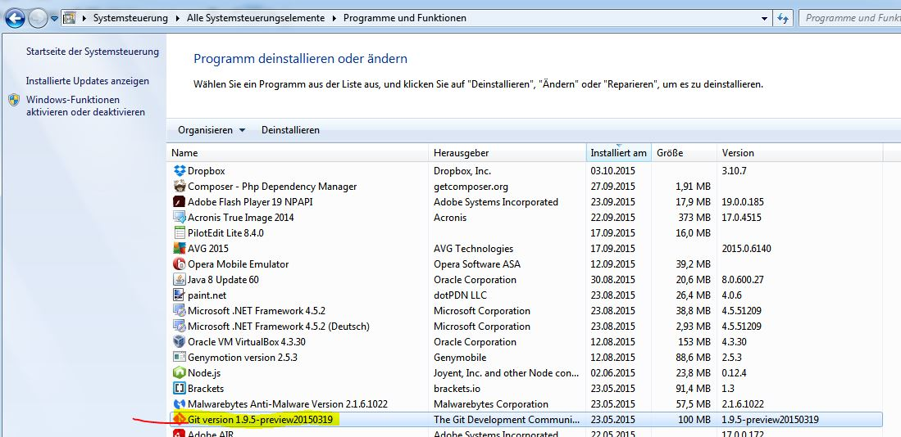
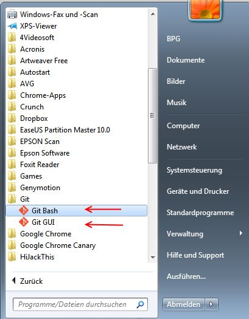
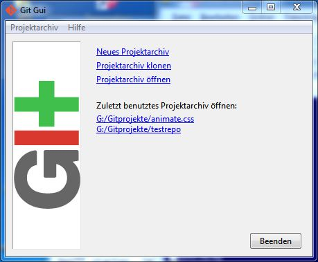
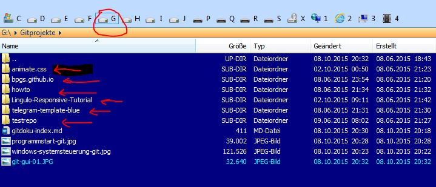
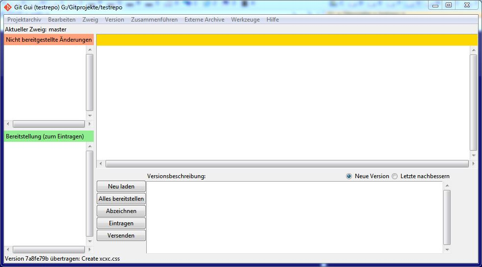
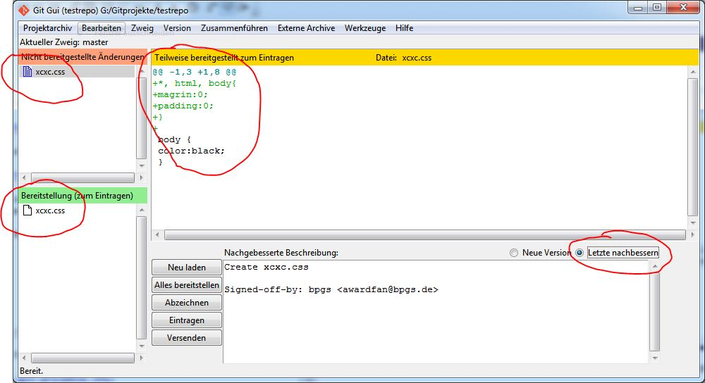
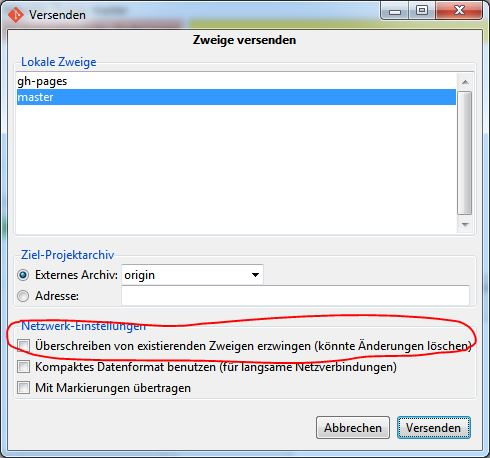
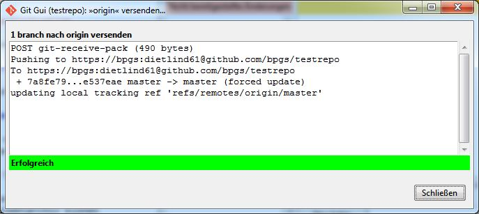
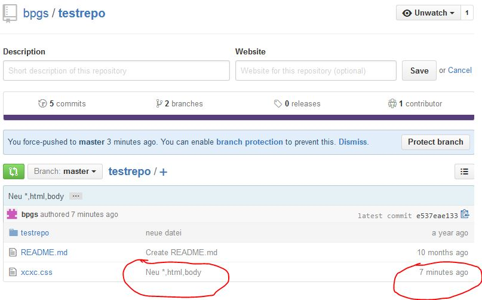

# Zur Arbeit mit Git

## Windows 7

### Ausgangssituation

Unter Windows ist die Windowsversion von Git installiert:

Man findet dann entsprechende Icons auf dem Desktop oder im Programmstart:

Man kann entweder das Kommandozeilentool **Git Bash** oder das visuelle Werkzeug **Git Gui** starten. Im Folgenden geht es um **Git Gui**.

Nach dem Start von Git Gui hat man 3 Möglichkeiten:

* ein neues Projektarchiv erstellen
* ein Projektarchiv klonen
* ein Projektarchiv öffnen

Außerdem werden frühere geöffnete Git-Projekte angezeigt.

### Projektarchiv öffnen und aktualisieren

Wir haben bereits aus früheren Aktivitäten eine Reihe von Git Projekten auf dem PC

Ich öffne **testrepo**. Das Programmfrenster sieht dann ungefähr so aus:

Mit einem externen Programm ändere ich die Datei `xcxc.css`. Jetzt aktiviere ich **Letzte nachbessern**.

Jetzt wird mir angezeigt, welche Dateien geändert wurden und was geändert wurde. Unter **Abzeichnen** kann ich einen Text eingeben. Jetzt klicke ich auf **Eintragen** und dann auf **Versenden**. dann erscheint dieses Bild:

Noch einmal Klick auf **Versenden**. Fall eine Fehlermeldung erscheint, dann mit markierte Option anklicken. Im Erfolgsfall erscheint:

In der Repo unter Github sieht man dann die Änderung

